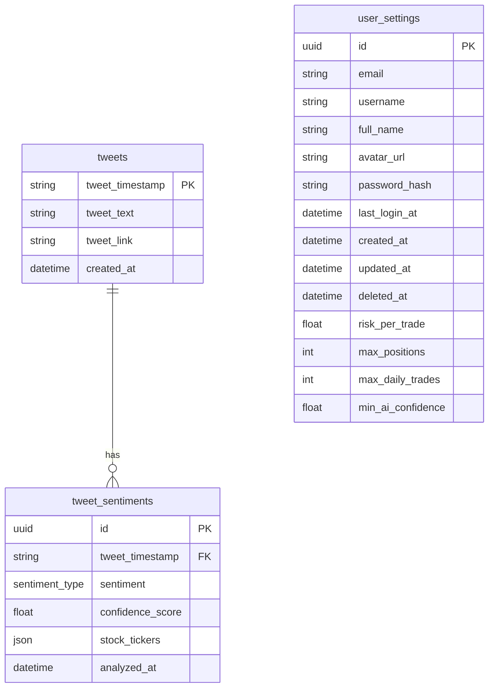

# CramerBot — Inverse Cramer Trading Bot

An automated algorithmic trading platform that monitors Jim Cramer's Twitter feed, analyzes sentiment with AI, and executes inverse trades based on the theory that contrarian betting against Cramer is profitable.

## Overview

CramerBot automatically:
1. **Scrapes** Jim Cramer's X (Twitter) feed in real-time
2. **Analyzes** tweets using Claude AI to extract tickers and sentiment
3. **Generates inverse signals** (bearish → BUY, bullish → SELL)
4. **Executes trades** via Alpaca API with manual or automated modes
5. **Tracks performance** with real-time portfolio metrics and equity charts

## Tech Stack

### Frontend
- **HTML/CSS/JavaScript** — Dashboard UI with dark theme
- **Tailwind CSS** — Responsive styling
- **Chart.js** — Real-time equity performance charts
- **Vanilla JS** — Signal feed, trade panel, portfolio management

### Backend
- **Python 3.14+** — Core runtime
- **FastAPI** — REST API framework
- **SQLAlchemy** — ORM for database models
- **Alembic** — Database schema migrations
- **Anthropic Claude API** — Sentiment analysis & ticker extraction
- **Alpaca Trade API** — Brokerage integration (paper + live trading)
- **Playwright** — X/Twitter scraping automation
- **asyncpg** — Async PostgreSQL driver

### Database
- **PostgreSQL** — Primary data store (hosted on Supabase)
- **Tables:**
  - `tweets` — Raw scraped tweets from Jim Cramer
  - `tweet_sentiments` — AI-analyzed sentiment, confidence, tickers
  - `user_settings` — User profiles, API keys, risk parameters

  ### Deployment Platforms
- **Render** — Hosting (Python/FastAPI backend)
- **Supabase** — PostgreSQL database & real-time subscriptions
- **Alpaca** — Trading API (paper trading for testing, live for production)

## Team Documents

You may find these helpful as you work together to organize your project.

- [Team Project Ideas](./docs/team_project_ideas.md)
- [Team Decision Log](./docs/team_decision_log.md)

Meeting Agenda templates (located in the `/docs` directory in this repo):

- Meeting - Voyage Kickoff --> ./docs/meeting-voyage_kickoff.docx
- Meeting - App Vision & Feature Planning --> ./docs/meeting-vision_and_feature_planning.docx
- Meeting - Sprint Retrospective, Review, and Planning --> ./docs/meeting-sprint_retrospective_review_and_planning.docx
- Meeting - Sprint Open Topic Session --> ./docs/meeting-sprint_open_topic_session.docx

## Database
The project uses PostgreSQL for data persistence, managed via SQLAlchemy ORM and Alembic migrations.

### Entity Relationship Diagram (ERD)


### Table Descriptions
| Table | Description | Purpose |
| :--- | :--- | :--- |
| **`tweets`** | Stores historical tweet data scraped from [Jim Cramer](https://www.cnbc.com/jim-cramer-bio/)'s [X account](https://twitter.com/jimcramer). | Primary source of trading signals; indexed by timestamp to prevent duplicates. |
| **`tweet_sentiments`** | Stores AI analysis of individual tweets. | Links to `tweets` via FK; contains sentiment scores and extracted stock tickers. |
| **`user_settings`** | Stores user authentication and trading preferences. | Manages profiles, login history, and risk management parameters (e.g., max positions). |

## Running Locally

To run app locally:
```bash
cd server
uv sync
uv run uvicorn main:app
```

## Our Team

- Alex Thomas (Scrum Master) [GitHub](https://github.com/BagelTime) / [LinkedIn](https://linkedin.com/in/ajt11176)
- Sobebar Ali [GitHub](https://github.com/sobebarali) / [LinkedIn](https://www.linkedin.com/in/sobebarali/)
- Tomislav Dukez [GitHub](https://github.com/tomdu3) / [Linkedin](https://www.linkedin.com/in/tomislav-dukez)
- Ndzana Christophe [GitHub](https://github.com/christoban) / [LinkedIn](https://linkedin.com/in/christophe-ndzana)
- Srikaanth Balajhi [GitHub](https://github.com/srikaanthtb) / [LinkedIn](https://www.linkedin.com/in/srikaanth-balajhi-4b6171131/)
- Conrado Figari Vechio (Product Owner) [GitHub](https://github.com/conradofigariv) / [LinkedIn](https://www.linkedin.com/in/conradofigarivechio/)
- Peter Kabamba [GitHub](https://github.com/pietrols) / [LinkedIn](https://linkedin.com/in/peter-kabamba-959a061b9)
- John Omokhagbon Ezekiel: [GitHub](https://github.com/Sirius1616) / [Linkedin](https://www.linkedin.com/in/john-ezekiel-dev/)
