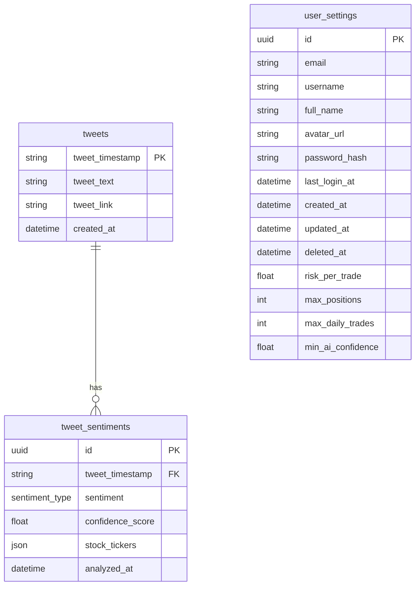

# voyage-tasks

Your project's `readme` is as important to success as your code. For
this reason you should put as much care into its creation and maintenance
as you would any other component of the application.

If you are unsure of what should go into the `readme` let this article,
written by an experienced Chingu, be your starting point -
[Keys to a well written README](https://tinyurl.com/yk3wubft).

And before we go there's "one more thing"! Once you decide what to include
in your `readme` feel free to replace the text we've provided here.

> Own it & Make it your Own!

## Team Documents

You may find these helpful as you work together to organize your project.

- [Team Project Ideas](./docs/team_project_ideas.md)
- [Team Decision Log](./docs/team_decision_log.md)

Meeting Agenda templates (located in the `/docs` directory in this repo):

- Meeting - Voyage Kickoff --> ./docs/meeting-voyage_kickoff.docx
- Meeting - App Vision & Feature Planning --> ./docs/meeting-vision_and_feature_planning.docx
- Meeting - Sprint Retrospective, Review, and Planning --> ./docs/meeting-sprint_retrospective_review_and_planning.docx
- Meeting - Sprint Open Topic Session --> ./docs/meeting-sprint_open_topic_session.docx

## Database
The project uses PostgreSQL for data persistence, managed via SQLAlchemy ORM and Alembic migrations.

### Entity Relationship Diagram (ERD)


### Table Descriptions
| Table | Description | Purpose |
| :--- | :--- | :--- |
| **`tweets`** | Stores historical tweet data scraped from [Jim Cramer](https://www.cnbc.com/jim-cramer-bio/)'s [X account](https://twitter.com/jimcramer). | Primary source of trading signals; indexed by timestamp to prevent duplicates. |
| **`tweet_sentiments`** | Stores AI analysis of individual tweets. | Links to `tweets` via FK; contains sentiment scores and extracted stock tickers. |
| **`user_settings`** | Stores user authentication and trading preferences. | Manages profiles, login history, and risk management parameters (e.g., max positions). |

## Running Locally

To run app locally:
```bash
cd server
uv sync
uv run uvicorn main:app
```

## Our Team

- Alex Thomas (Scrum Master) [GitHub](https://github.com/BagelTime) / [LinkedIn](https://linkedin.com/in/ajt11176)
- Sobebar Ali [GitHub](https://github.com/sobebarali) / [LinkedIn](https://www.linkedin.com/in/sobebarali/)
- Tomislav Dukez [GitHub](https://github.com/tomdu3) / [Linkedin](https://www.linkedin.com/in/tomislav-dukez)
- Ndzana Christophe [GitHub](https://github.com/christoban) / [LinkedIn](https://linkedin.com/in/christophe-ndzana)
- Srikaanth Balajhi [GitHub](https://github.com/srikaanthtb) / [LinkedIn](https://www.linkedin.com/in/srikaanth-balajhi-4b6171131/)
- Conrado Figari Vechio (Product Owner) [GitHub](https://github.com/conradofigariv) / [LinkedIn](https://www.linkedin.com/in/conradofigarivechio/)
- Peter Kabamba [GitHub](https://github.com/pietrols) / [LinkedIn](https://linkedin.com/in/peter-kabamba-959a061b9)
- John Omokhagbon Ezekiel: [GitHub](https://github.com/Sirius1616) / [Linkedin](https://www.linkedin.com/in/john-ezekiel-dev/)